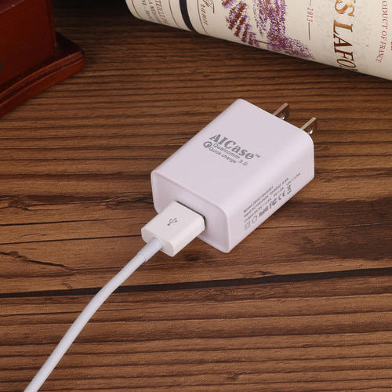
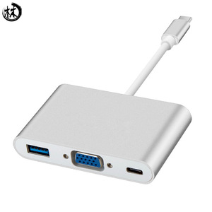

# Adapter(Wrapper)

> 将一种类的接口转换成另一种客户端期望的接口，适配器使由于接口不兼容而无法一起工作的类能够协同工作。

Adapter 愿意就是转换器，例如家用电 220V, 手机充电口电压 5V, 手机充电器就是一种电压转换器。

适配器模式有两种实现：

- 类实现型方式：继承两种接口，内部实现调用。

- 对象型适配器：在 TextShape 中组合一个 TextView 实例，并根据 TextView 的接口实现 TextShape。此时的 `TextShape` 就是 `Adapter`, 而 `TextView` 是 `Adaptee`。

但是有很对语言不支持多继承，所以对象型适配器才是更灵活、通用的类型。

**容易误导的地方是一些常见的叫 XXXAdaper 的类，并不一定是 Adapter 模式。** Adapter 的核心是适配两中不同的接口。

